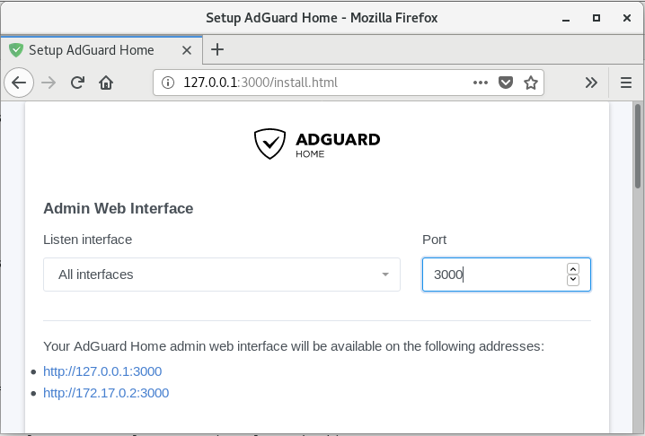
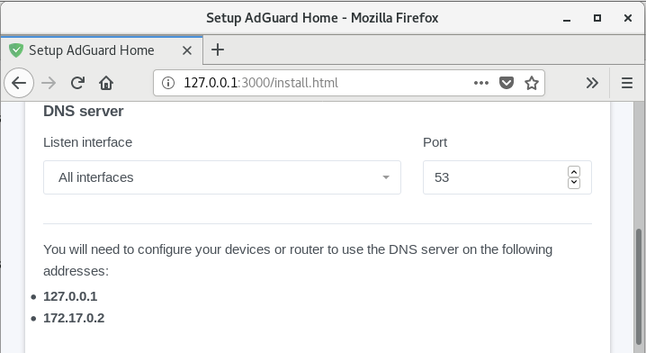
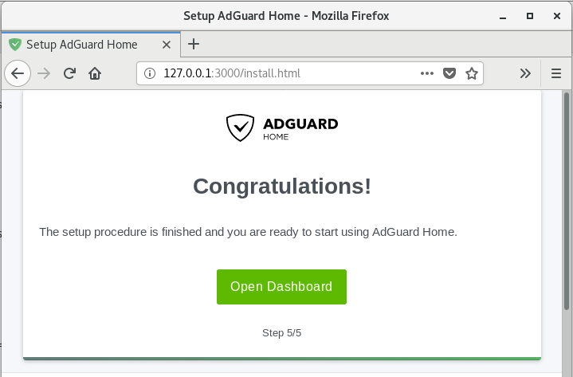
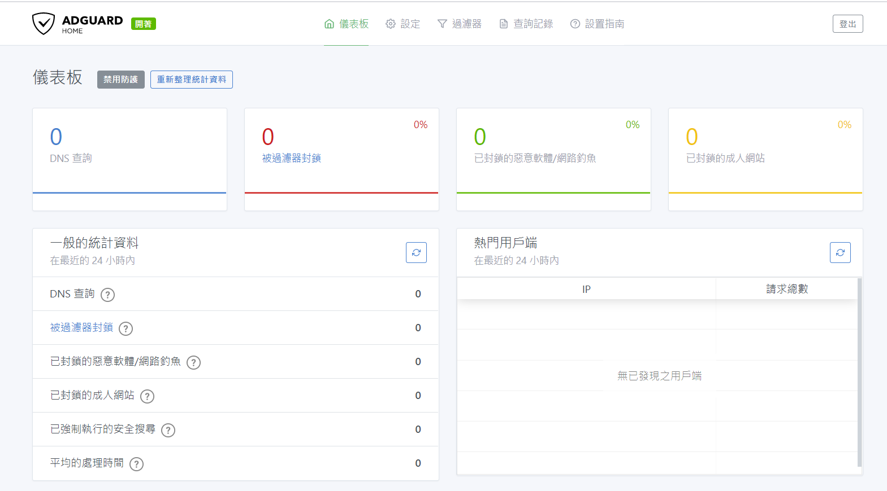

# Docker
## Centos7 利用 docker 在觀看 youtube 時不受廣告干擾
### 概念圖


### 使 vm2 可以透過 vm1 連網
> 準備兩台虛擬機 vm1、vm2
1. vm1 準備三張網路卡

名稱|網路卡|
-|-
NAT|enp0s3
Host-Only|enp0s8
內部網路|enp0s9

* 設定內部網路 IP 
`ip addr add 192.168.1.1/24 brd + dev enp0s9`
* 開啟路由功能(暫時)
`echo 1 > /proc/sys/net/ipv4/ip_forward`
or
`sysctl -w net.ipv4.ip_forward=1`
* 允許新連線封包
```sh   
iptables -A FORWARD -o enp0s3 -i enp0s9 -s 192.168.1.0/24 -m conntrack --ctstate NEW -j ACCEPT
        # Append   # Output  # Input
```
* 允許連線成立封包
```sh
iptables -A FORWARD -m conntrack --ctstate ESTABLISHED,RELATED -j ACCEPT
```
* 使內部 IP 可以轉換成對外 IP
```sh
iptables -t nat -A POSTROUTING -o enp0s3 -s 192.168.1.0/24 -j MASQUERADE
        # Table                         # Souese          # Jump # trans to NAT
```

2. vm2 準備一張內部網路卡

名稱|網路卡|
-|-
內部網路|enp0s3

* 設定內部網路 IP
`ip addr add 192.168.1.2/24 brd + dev enp0s3`
* 設定內定路由
`ip route add default via 192.168.1.1`

> * 其他狀況
>   * 開啟路由功能(永久) `vim /etc/sysctl.conf`並加入 `net.ipv4.ip_forward = 1`
>   * 刪除預定路由 `ip route del default via 192.168.1.1`
>   * 修改 DNS 伺服器 `vim /etc/resolv.conf`

### 安裝 docker 
> 在 vm1 上安裝
* vm1
    - `yum install -y yum-utils`
    - `yum-config-manager --add-repo https://download.docker.com/linux/centos/docker-ce.repo`
    - `yum install docker-ce docker-ce-cli containerd.io`
    -  `systemctl start docker`

* 可以查看是否安裝成功
```sh
[root@vm1 user]# docker --version
Docker version 19.03.12, build 48a66213fe
```
### 使用 adguard
> 在 vm1 上使用，參考 [adguard/adguardhome - Docker Hub](https://hub.docker.com/r/adguard/adguardhome)
* vm1
    - `docker pull adguard/adguardhome`
    - `mkdir -p /my/own/workdir`
    - `mkdir -p /my/own/confdir`
    - `docker run --name adguardhome -v /my/own/workdir:/opt/adguardhome/work -v /my/own/confdir:/opt/adguardhome/conf -p 53:53/tcp -p 53:53/udp -p 67:67/udp -p 68:68/tcp -p 68:68/udp -p 80:80/tcp -p 443:443/tcp -p 853:853/tcp -p 3000:3000/tcp -d adguard/adguardhome`

* firefox
    - 網址輸入 `127.0.0.1:3000`

    

    - 將 port 號設成 3000，53 port 不用改

    
    

    - 自訂帳號密碼
    - 設定成功

    

## 測試
1. 在 Windows 上輸入 vm1 的 IP:3000，輸入剛剛設定的帳密



2. 在 vm2 上觀看 youtube，回到 Adguard 看是否阻擋廣告成功


---
參考資料：
- [Install Docker Engine on CentOS | Docker Documentation](https://docs.docker.com/engine/install/centos/)
- [adguard/adguardhome - Docker Hub](https://hub.docker.com/r/adguard/adguardhome)
- [Synology Docker 架設 AdGuard Home DNS 伺服器](https://www.sakamoto.blog/synology-adguard-home-dns/)