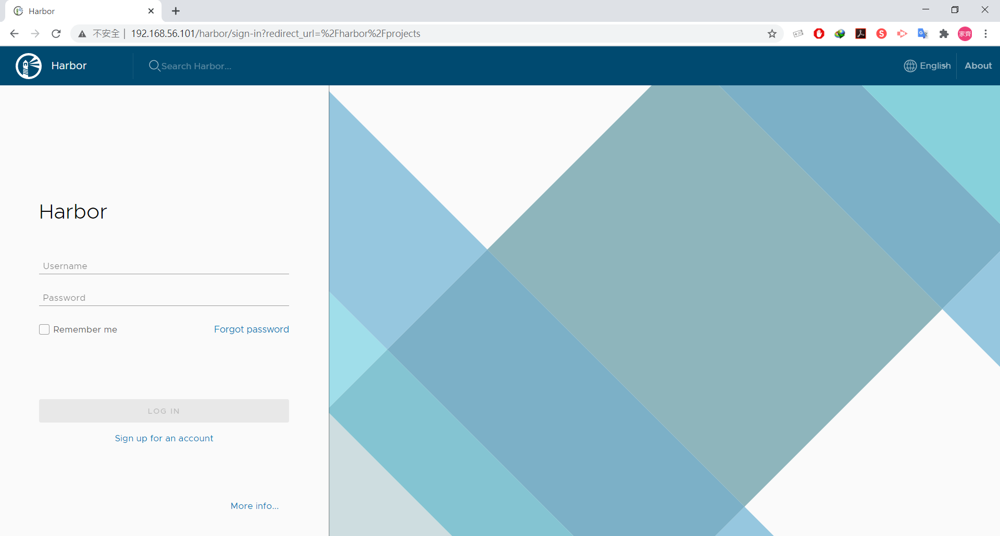
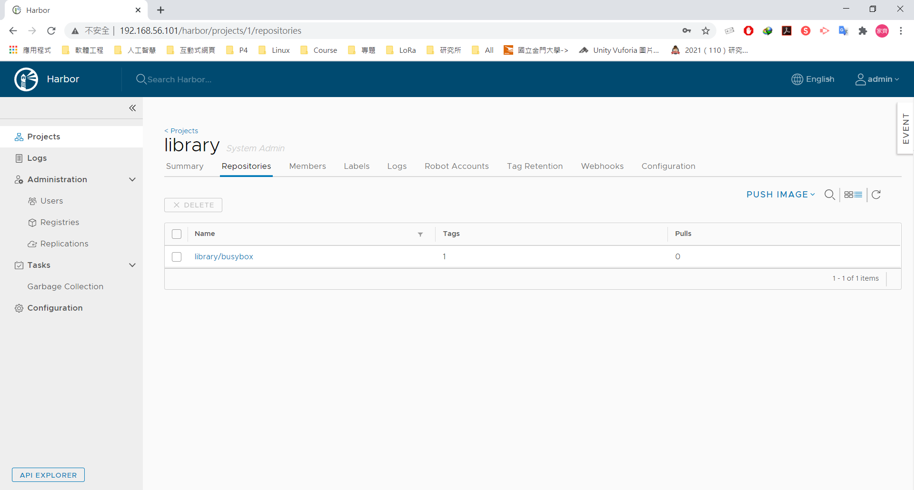

* [Docker 實作](https://github.com/linjiachi/Linux_note/blob/master/109-1%20Docker/W4-20201006.md#docker-%E5%AF%A6%E4%BD%9C)
    - [將資料從第一台(192.168.56.101)傳到第二台機器(192.168.56.102)](https://github.com/linjiachi/Linux_note/blob/master/109-1%20Docker/W4-20201006.md#%E5%B0%87%E8%B3%87%E6%96%99%E5%BE%9E%E7%AC%AC%E4%B8%80%E5%8F%B019216856101%E5%82%B3%E5%88%B0%E7%AC%AC%E4%BA%8C%E5%8F%B0%E6%A9%9F%E5%99%A819216856102)
    - [查看 docker 容器使用的資源](https://github.com/linjiachi/Linux_note/blob/master/109-1%20Docker/W4-20201006.md#%E6%9F%A5%E7%9C%8B-docker-%E5%AE%B9%E5%99%A8%E4%BD%BF%E7%94%A8%E7%9A%84%E8%B3%87%E6%BA%90)
    - [Harbor 私有倉儲](https://github.com/linjiachi/Linux_note/blob/master/109-1%20Docker/W4-20201006.md#harbor-%E7%A7%81%E6%9C%89%E5%80%89%E5%84%B2)
        - [安裝 docker harbor](https://github.com/linjiachi/Linux_note/blob/master/109-1%20Docker/W4-20201006.md#%E5%AE%89%E8%A3%9D-docker-harbor)
        - [上傳鏡像檔至 Harbor](https://github.com/linjiachi/Linux_note/blob/master/109-1%20Docker/W4-20201006.md#%E4%B8%8A%E5%82%B3%E9%8F%A1%E5%83%8F%E6%AA%94%E8%87%B3-harbor)
    - [Docker Network](https://github.com/linjiachi/Linux_note/blob/master/109-1%20Docker/W4-20201006.md#docker-network)
        - [none network：在啟動 docker 的時候，不要開啟任何網路](https://github.com/linjiachi/Linux_note/blob/master/109-1%20Docker/W4-20201006.md#none-network%E5%9C%A8%E5%95%9F%E5%8B%95-docker-%E7%9A%84%E6%99%82%E5%80%99%E4%B8%8D%E8%A6%81%E9%96%8B%E5%95%9F%E4%BB%BB%E4%BD%95%E7%B6%B2%E8%B7%AF)
        - [host network：docker 的網路和 host 網路一樣](https://github.com/linjiachi/Linux_note/blob/master/109-1%20Docker/W4-20201006.md#host-networkdocker-%E7%9A%84%E7%B6%B2%E8%B7%AF%E5%92%8C-host-%E7%B6%B2%E8%B7%AF%E4%B8%80%E6%A8%A3)
        - [bridge network：橋接網路，預設的網路 (docker 0)](https://github.com/linjiachi/Linux_note/blob/master/109-1%20Docker/W4-20201006.md#bridge-network%E6%A9%8B%E6%8E%A5%E7%B6%B2%E8%B7%AF%E9%A0%90%E8%A8%AD%E7%9A%84%E7%B6%B2%E8%B7%AF-docker-0)

---
# Docker 實作
## 將資料從第一台(192.168.56.101)傳到第二台機器(192.168.56.102)
**vm1**
* 將 docker Image 存檔出一個檔案

    ```sh
    docker save -o myhttpd.tar 417
    ```
    - `-o`：output，輸出檔案
* 將資料傳到第二台機器
    
    ```sh
    scp myhttpd.tar user@192.168.56.102:/home/user
    ```

    ```sh
    [root@vm1 user]# scp myhttpd.tar user@192.168.56.102:/home/user
    user@192.168.56.102's password:
    myhttpd.tar                    100%  135MB  42.9MB/s   00:03
    ```
**vm2**
* 查看是否傳成功
    ```sh
    [root@vm2 user]# ls
    Desktop    Downloads  myhttpd.tar  Public     Videos
    Documents  Music      Pictures     Templates
    ```
* 載入至機器：`docker load -i myhttpd.tar`
## 查看 docker 容器使用的資源
* 容器分析，Docker 有提供指令讓使用者可以查看目前 Docker Container 所使用的 CPU、記憶體、網路 I/O...等等的資源使用量

    ```sh
    docker stats
    ```
* 取得 Container 的紀錄
    ```sh
    docker logs [Container ID]
    ```
* 取得容器 or 鏡像的數據

    ```sh
    docker inspect [Container/Image]
    ```
## Harbor 私有倉儲
* Harbor 是 Docker 的鏡像倉庫
### 安裝 docker harbor
> search：github docker harbor，參考 [Docker容器倉庫Harbor的安裝部署](https://kknews.cc/zh-tw/code/5n9poj6.html)，我們選擇下載較穩定的版本 v1.9.0 [Github goharbor/harbor](https://github.com/goharbor/harbor/releases/tag/v1.9.0)

1. 檢查是否安裝 docker-compose

    ```sh
    docker-compose --version
    ```
2. 下載 http://csie.nqu.edu.tw/smallko/harbor1.9.0.tgz

    ```sh
    wget http://csie.nqu.edu.tw/smallko/harbor1.9.0.tgz
    ```
3. 解壓縮

    ```sh
    tar xvfz harbor1.9.0.tgz
    ```
4. 進到 /harbor，並更改 harbor.yml，將 hostname 更改為 vm1 的 IP

    ```yml
    # The IP address or hostname to access admin UI and registry service.
    # DO NOT use localhost or 127.0.0.1, because Harbor needs to be accessed by external clients.
    hostname: 192.168.56.101
    ```
5. 執行安裝

    ```sh
    sh install.sh
    ```
6. 在 Chrome 上輸入 vm1 IP，並登入

    
    

7. 再次開啟 docker harbor
> 進入到安裝目錄，可以看到一個 docker-compose.yml 文件，此文件就是用來控制 harbor 的啟動和停止。
    
    docker-compose start # 啟動
    docker-compose stop # 停止
    
### 上傳鏡像檔至 Harbor
1. 重新將鏡像標籤命名

    ```sh
    docker tag [Image ID] 192.168.56.101/library/busybox:latest
    ```
2. 這是因為 docker 默認使用的是 https 連接，而 harbor 默認使用 http 連接。對於這樣的情況，需要在客戶端的 docker 伺服器上添加如下此參數，表示它是個一個非安全類倉庫。

    ```sh
    
    [root@vm1 harbor]# vim /etc/docker/daemon.json

    {
    "insecure-registries":["192.168.56.101"] # 倉儲的 IP
    }

    ```
3. 重啟 docker 服務

    ```sh
    systemctl daemon-reload
    systemctl restart docker
    ```
    > 有時候會影響到 docker，故要在有 `docker-compose.yml` 的資料夾下執行 `docker-compose up -d`

4. 登入 Harbor 私有倉儲  

    ```sh
    [root@vm1 harbor]# docker login 192.168.56.101
    Username: admin
    Password:
    WARNING! Your password will be stored unencrypted in /root/.docker/config.json.
    Configure a credential helper to remove this warning. See
    https://docs.docker.com/engine/reference/commandline/login/#credentials-store

    Login Succeeded
    ```
5. 上傳鏡像檔至 Harbor

    ```sh
    [root@vm1 harbor]# docker push 192.168.56.101/library/busybox:latest
    The push refers to repository [192.168.56.101/library/busybox]
    be8b8b42328a: Pushed
    latest: digest: sha256:2ca5e69e244d2da7368f7088ea3ad0653c3ce7aaccd0b8823d11b0d5de956002 size: 527
    ```
6. 查看有無成功

    

7. 從 Harbor 下載 Image

    ```sh
    docker pull 192.168.56.101/library/busybox:latest
    ```
## Docker Network
* 檢視安裝好 docker 後，docker network 的狀況
```sh
[root@vm1 harbor]# docker network ls
NETWORK ID          NAME                DRIVER              SCOPE
b3449801df6e        bridge              bridge              local
e25238b9c976        harbor_harbor       bridge              local
a9717612a6d0        host                host                local
5426b82b0482        none                null                local
```

### none network：在啟動 docker 的時候，不要開啟任何網路
* `docker run -it --name=none busybox:latest sh`  
```sh
[root@vm1 harbor]# docker run -it --name=none busybox:latest sh
/ # ifconfig
lo        Link encap:Local Loopback
          inet addr:127.0.0.1  Mask:255.0.0.0
          UP LOOPBACK RUNNING  MTU:65536  Metric:1
          RX packets:0 errors:0 dropped:0 overruns:0 frame:0
          TX packets:0 errors:0 dropped:0 overruns:0 carrier:0
          collisions:0 txqueuelen:1000
          RX bytes:0 (0.0 B)  TX bytes:0 (0.0 B)
```
### host network：docker 的網路和 host 網路一樣
* 可以用來測試防毒、防攻擊偵測，因為網路與主機相同
* `docker run -it --network=host busybox:latest sh`

### bridge network：橋接網路，預設的網路 (docker 0)
* bridge 的架構

    

* bridge network 是利用 Docker Host 上的
* `docker run -it --network=bridge --name a1 busybox:latest`
* `brctl show`：顯示在橋接器上現在連接那些網路卡
* `docker network create --driver bridge mynet`：自建一個網路隔離出來
* `docker run -it --name a3 --network mynet busybox sh`
    * 示意圖
    
        > docker 0 和 mynet 兩個網路是隔離的\

**補充：讓隔離的 docker 0 和 mynet 可以互 ping**
* `docker network connect bridge a1`：讓 a1 連到 bridge 網路
* `docker network disconnect bridge a1`：斷開 a1 和 bridge 網路

    * 示意圖
    
    
---
參考資料：
- [Day9：如何備份 Docker Image 為 tar 檔](https://ithelp.ithome.com.tw/articles/10191387)
- [Docker容器倉庫Harbor的安裝部署](https://kknews.cc/zh-tw/code/5n9poj6.html)
- [Harbor倉庫介紹與搭建過程](https://www.itread01.com/content/1526620986.html)
- [Github goharbor/harbor](https://github.com/goharbor/harbor/releases/tag/v1.9.0)
- [[Docker] Bridge Network 簡介](https://godleon.github.io/blog/Docker/docker-network-bridge/)