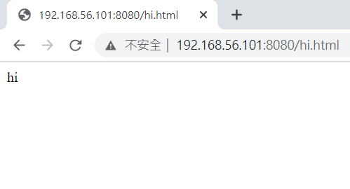
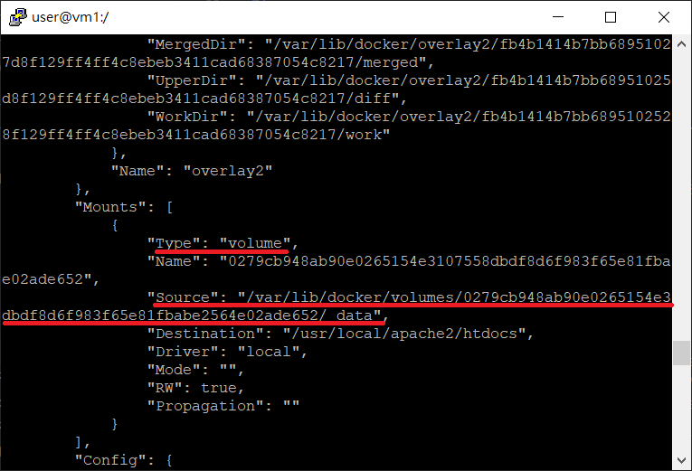
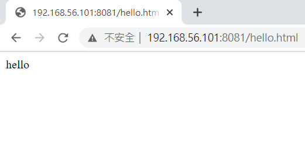
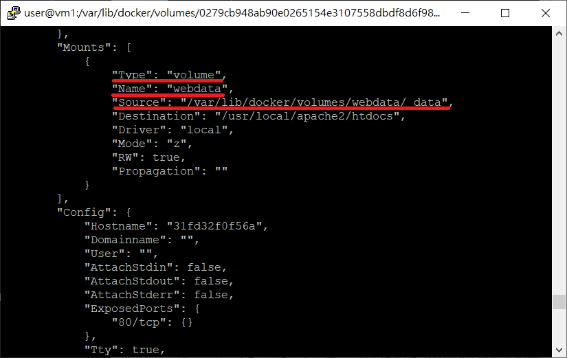
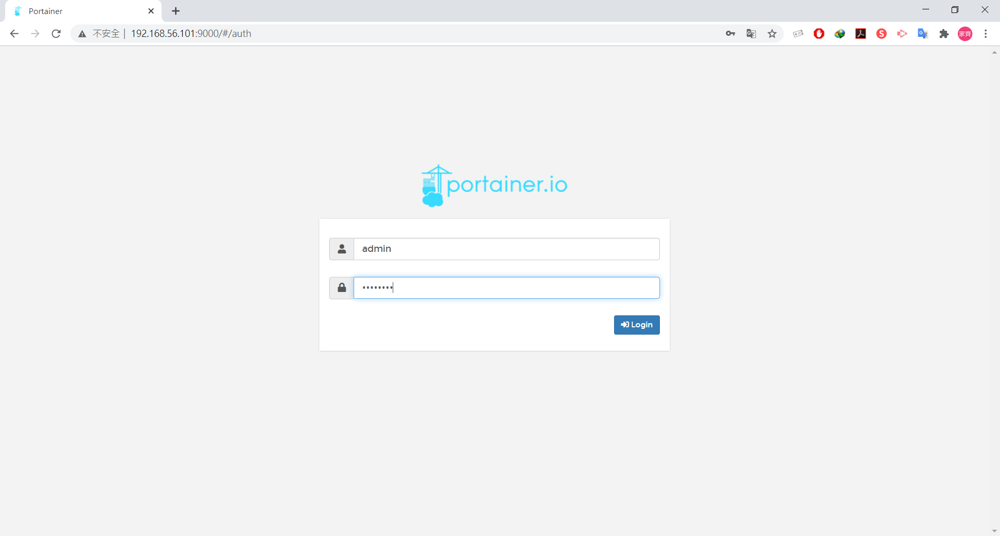
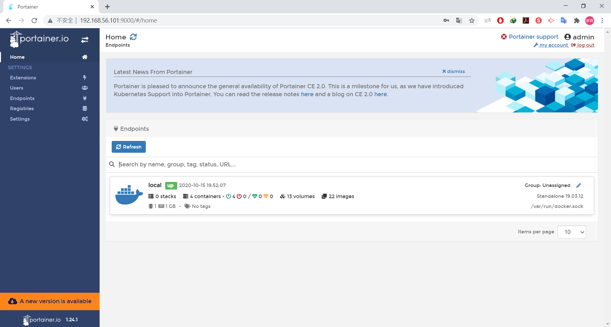

* [Docker Network](https://github.com/linjiachi/Linux_note/blob/master/109-1%20Docker/W5-20201013.md#docker-network)
    - [容器互連（linking）](https://github.com/linjiachi/Linux_note/blob/master/109-1%20Docker/W5-20201013.md#%E5%AE%B9%E5%99%A8%E4%BA%92%E9%80%A3linking)
    - [使用自訂的 bridge Network](https://github.com/linjiachi/Linux_note/blob/master/109-1%20Docker/W5-20201013.md#%E4%BD%BF%E7%94%A8%E8%87%AA%E8%A8%82%E7%9A%84-bridge-network)
    - [資料卷 Data Volume](https://github.com/linjiachi/Linux_note/blob/master/109-1%20Docker/W5-20201013.md#%E8%B3%87%E6%96%99%E5%8D%B7-data-volume)
        - [A. 將本機端資料夾掛載在 Docker 的網頁伺服器](https://github.com/linjiachi/Linux_note/blob/master/109-1%20Docker/W5-20201013.md#a-%E5%B0%87%E6%9C%AC%E6%A9%9F%E7%AB%AF%E8%B3%87%E6%96%99%E5%A4%BE%E6%8E%9B%E8%BC%89%E5%9C%A8-docker-%E7%9A%84%E7%B6%B2%E9%A0%81%E4%BC%BA%E6%9C%8D%E5%99%A8)
        - [B. 沒有名稱的 Data Volume](https://github.com/linjiachi/Linux_note/blob/master/109-1%20Docker/W5-20201013.md#b-%E6%B2%92%E6%9C%89%E5%90%8D%E7%A8%B1%E7%9A%84-data-volume)
        - [C. 有名稱的 Data Volume](https://github.com/linjiachi/Linux_note/blob/master/109-1%20Docker/W5-20201013.md#c-%E6%9C%89%E5%90%8D%E7%A8%B1%E7%9A%84-data-volume)
* [Portainer - 圖形化介面管理 docker](https://github.com/linjiachi/Linux_note/blob/master/109-1%20Docker/W5-20201013.md#portainer---%E5%9C%96%E5%BD%A2%E5%8C%96%E4%BB%8B%E9%9D%A2%E7%AE%A1%E7%90%86-docker)
---
# Docker Network
## 容器互連（linking）
1. 自定義容器並命名為 c1
```sh
docker run -it --name c1 busybox sh
```
2. 開啟另一個 terminal，將 c1、c2 容器建立互連
```sh
docker run -it --name c2 --link c1:c1 busybox sh
```
3. c2 ping c1
* c2 可以利用 c1 的 **IP** 及 **domain name** ping
```sh
ping <c1 IP> or ping c1
```
```sh
[root@vm1 user]# docker run -it --name c2 --link c1:c1 busybox sh
/ # ping 127.17.0.3
PING 127.17.0.3 (127.17.0.3): 56 data bytes
64 bytes from 127.17.0.3: seq=0 ttl=64 time=0.097 ms
64 bytes from 127.17.0.3: seq=1 ttl=64 time=0.105 ms
64 bytes from 127.17.0.3: seq=2 ttl=64 time=0.067 ms
^C
/ # ping c1
PING c1 (172.17.0.3): 56 data bytes
64 bytes from 172.17.0.3: seq=0 ttl=64 time=0.098 ms
64 bytes from 172.17.0.3: seq=1 ttl=64 time=0.130 ms
64 bytes from 172.17.0.3: seq=2 ttl=64 time=0.069 ms
```
**在執行 --link 會將 IP 和 domain name 連在一起，所以 c1 不能利用 c2 的 domain name ping c2**
```sh
/ # cat /etc/hosts
127.0.0.1       localhost
::1     localhost ip6-localhost ip6-loopback
fe00::0 ip6-localnet
ff00::0 ip6-mcastprefix
ff02::1 ip6-allnodes
ff02::2 ip6-allrouters
172.17.0.3      c1 cf8807e33fa6
172.17.0.4      c38148f230c3
```
## 使用自訂的 bridge Network
* 參考 [Docker 與 DNS](https://dotblogs.com.tw/grassshrimp_tech_intern/2016/06/18/071957)
* 自己建的 bridge 網路，容器之間的通訊可以直接利用 domain name 
1. 創造一個新的網路並命名成 mynet
```sh
docker network create -d bridge mynet
                   # --driver
```
2. 建立兩個容器 db、web
```sh
docker run -d --net=mynet --name db training/postgres
docker run -d --net=mynet --name web training/webapp
```
3. 進入 web 容器中並 ping web 及 db
```sh
docker exec -it web bash
ping web
ping db
```
## 資料卷 Data Volume
* Data Volume 是一個掛載在容器內檔案系統中的檔案或目錄
### A. 將本機端資料夾掛載在 Docker 的網頁伺服器
* 缺點：容器容易因為 /data 的權限，而導致無法寫入
```sh
# 建立一個 html 檔
[root@vm1 user]# mkdir -p /data
[root@vm1 user]# cd /data
[root@vm1 data]# echo "hi" > hi.html
[root@vm1 data]# cd ..

# 將本機端的 /data 映射到網頁伺服器首頁的位置
[root@vm1 /]# docker run -itd --name myweb -p 8080:80 -v /data:/usr/local/apache2/htdocs httpd
```
* 開啟 Chrome 並輸入 `192.168.56.101:8080/hi.html`



### B. 沒有名稱的 Data Volume
* 因為沒有名稱，故在管理上較不方便
1. 新建一個容器 myweb1 port 改成 8081，並將 /data 資料夾拿掉
```sh
[root@vm1 /]# docker run -itd --name myweb1 -p 8081:80 -v /usr/local/apache2/htdocs httpd
```
2. 查看 myweb1 詳細資訊
```sh
[root@vm1 /]# docker inspect myweb1
```
3. 找到 volume 的所在位置，並切換至此



```sh
[root@vm1 /]# cd /var/lib/docker/volumes/0279cb948ab90e0265154e3107558dbdf8d6f983f65e81fbabe2564e02ade652/_data/
[root@vm1 _data]# echo "hello" > hello.html
```
4. 開啟 Chrome 並輸入 `192.168.56.101:8081/hello.html`



### C. 有名稱的 Data Volume
* 在管理上較方便
1. 新增一個 Data Volume，命名為 webdata
```sh
[root@vm1 _data]# docker volume create --name webdata
webdata
[root@vm1 _data]# docker volume ls
[root@vm1 _data]# docker run -itd --name myweb2 -p 8082:80 -v webdata:/usr/local/apache2/htdocs httpd
31fd32f0f56abf7ad45107d52c1e81d7bf6f7b468123f573e4eaebbc38d3b457
```
2. 查看 myweb2 詳細資訊
```sh
[root@vm1 _data]# docker inspect 31f
```
3. 找到 volume 的所在位置，並切換至此



```sh
[root@vm1 _data]# cd /var/lib/docker/volumes/webdata/_data/

[root@vm1 _data]# echo "1" > 1.html
[root@vm1 _data]# echo "2" > 2.html
```
4. 新增一個容器 myweb3 port 改成 8083，並使用相同的 Data Volume
```sh
[root@vm1 _data]# docker run -itd --name myweb3 -p 8083:80 -v webdata:/usr/local/apache2/htdocs httpd
51c0728c1f3508ba4558958479cd6bfbfcd55e2899742242a4ed1ab867d9581f
```
5. 開啟 Chrome 並輸入  
* `192.168.56.101:8082/1.html`
* `192.168.56.101:8082/2.html`
* `192.168.56.101:8083/1.html`
* `192.168.56.101:8083/2.html`

# Portainer - 圖形化介面管理 docker
1. 安裝 Portainer
```sh
[root@vm1 _data]# docker run -d -p 9000:9000 --restart=always --name portainer -v /var/run/docker.sock:/var/run/docker.sock -v /Users/lee/dev/docker_file/portainer/data:/data docker.io/portainer/portainer
5f21ad2ec77682802b63df0c48181bb018fd20148e3575c7044882abecd3abef
```
2. open windows and type ip:9000
* 帳：admin，密：12345678
* 登入後，選擇 Local




---
參考資料：
- [Docker--從入門到實踐 容器互連](https://philipzheng.gitbook.io/docker_practice/network/linking)
- [Docker 與 DNS](https://dotblogs.com.tw/grassshrimp_tech_intern/2016/06/18/071957)
- [Portainer一个轻量级的Docker环境管理UI](https://www.kubernetes.org.cn/5883.html)
- [Docker – Dockerfile 指令教學，含範例解說](https://www.jinnsblog.com/2018/12/docker-dockerfile-guide.html)