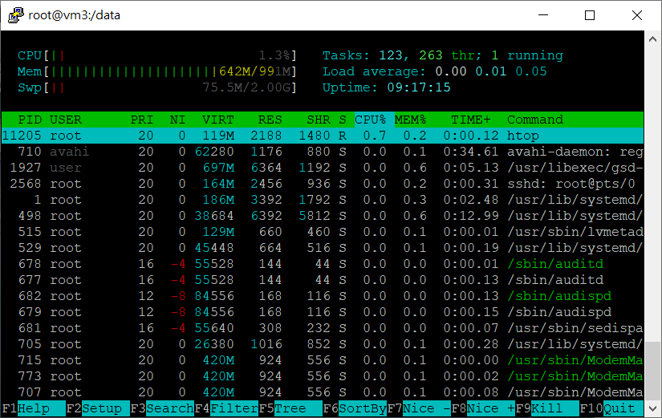
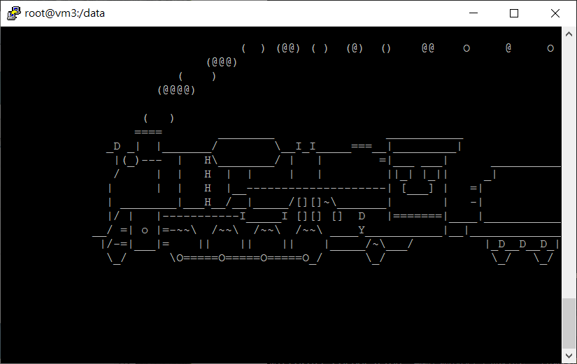
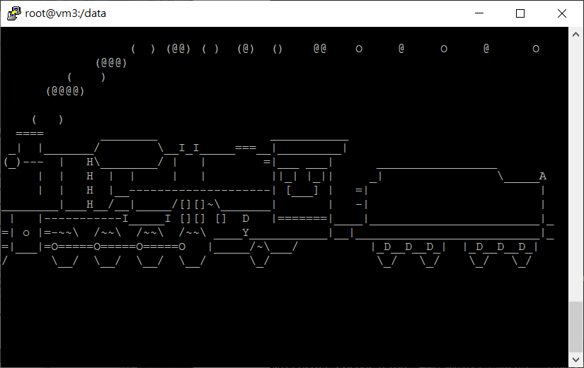

## 建立一個安裝 httpd 的腳本
1. `vim install_httpd.sh`
```sh
#!/usr/bin/env bash

yum install -y httpd
systemctl start httpd
systemctl enable httpd
```

## 範例一：httpd.yml
1. 新建一個腳本 `vim httpd.yml`
```yml
---
- hosts: app1
  remote_user: root
  tasks:
    - name: install httpd     # 安裝 httpd 套件
      yum: name=httpd 
    - name: copy hi.htm
      copy: src=files/hi.htm dest=/var/www/html
      tags: hi                # -t 的判斷
    - name: start httpd service
      tags: service
      service: name=httpd state=started enabled=yes
```
2. 執行腳本 `ansible-playbook httpd.yml`
```sh      
[root@vm1 user]# ansible-playbook httpd.yml

PLAY [app1] **********************************************   **********************

TASK [Gathering Facts] ***********************************   **********************
ok: [192.168.56.102]

TASK [install httpd] *************************************   **********************
ok: [192.168.56.102]

TASK [copy hi.htm] ***************************************   **********************
changed: [192.168.56.102]

TASK [start httpd service] *******************************   **********************
ok: [192.168.56.102]

PLAY RECAP ***********************************************   **********************
192.168.56.102             : ok=4    changed=1    unreacha   ble=0    failed=0
```
3. 執行結果
```sh
[root@vm1 user]# tree files/
files/
└── hi.htm
```
4. 假如修改 hi.htm 檔案，如果執行 playbook會從頭執行一次，這樣效率很低，因為我們只需要執行某一項工作，於是可以使用 `-t`：是判斷 tags \
`ansible-playbook -t hi httpd.yml`

## setup 模組：可以看 app1群組 的系統配置資訊
```sh
[root@vm1 user]# ansible app1 -m setup | grep hostname
        "ansible_hostname": "vm2",
```

## 範例二：app.yml
1. 新建一個腳本 `vim app.yml`
```yml
---
- hosts: app1
  remote_user: root
  tasks:
    - name: install package
      yum: name={{ pkname }}    # parameter 透過 {{}} 包著
    - name: start service
      service: name={{ pkname }} state=started enabled=yes
```
2. 執行指令：`ansible-playbook -e 'pkname=vsftpd' app.yml`
- `-e`：傳參數
- `pkname`：變數名稱
```sh
[root@vm1 user]# ansible-playbook -e 'pkname=vsftpd' app.yml

PLAY [app1] ********************************************************************

TASK [Gathering Facts] *********************************************************
ok: [192.168.56.102]

TASK [install package] *********************************************************
changed: [192.168.56.102]

TASK [start service] ***********************************************************
changed: [192.168.56.102]

PLAY RECAP *********************************************************************
192.168.56.102             : ok=3    changed=2    unreachable=0    failed=0
```

## 範例三：app2.yml
* 如果要安裝兩個一樣的package，可以取不同名字
1. 新建一個腳本 `vim app2.yml`
```yml
---
- hosts: app1
  remote_user: root
  tasks:
    - name: install package
      yum: name={{ pkname1 }}
    - name: install package
      yum: name={{ pkname2 }}
```
2. 執行指令：`ansible-playbook -C -e "pkname1=httpd pkname2=vsftpd" app2.yml`
```sh    
[root@vm1 user]# ansible-playbook -C -e "pkname1=httpd pkname2=vsftpd" app2.yml

PLAY [app1] ********************************************************************

TASK [Gathering Facts] *********************************************************
ok: [192.168.56.102]

TASK [install package] *********************************************************
ok: [192.168.56.102]

TASK [install package] *********************************************************
ok: [192.168.56.102]

PLAY RECAP *********************************************************************
192.168.56.102             : ok=3    changed=0    unreachable=0    failed=0
```

## 範例四：test1.yml - 更改 hostname
1. 新建一個腳本 `vim test1.yml`
```yml
---
- hosts: myapp
  remote_user: root
  tasks:
   - name: change hostname
     hostname: name=centos-{{ http_port }}.example.com
    # 用來改變主機的名稱
```
2. 執行指令：`ansible-playbook test1.yml`

## 範例五：test2.yml
1. 到 `/etc/ansible/hosts` 下增加 `[myapp:vars]`
```sh
[myapp]
192.168.56.101 http_port=80
192.168.56.102 http_port=81
192.168.56.103 http_port=82

# 劇本定義
[myapp:vars]
nodename=centos
domainname=example.com
```
2. 新建一個腳本 `vim test2.yml`
```yml
---
- hosts: myapp
  remote_user: root
  tasks:
    - name: change hostname
      hostname: name={{ nodename }}-{{ http_port }}.{{ domainname }}
```
3. 執行指令：`ansible-playbook -e "nodename=test domainname=test.com" test2.yml` 手動定義
```sh
[root@vm1 user]# ansible-playbook -e "nodename=test domainname=test.com" test2.yml

PLAY [myapp] *******************************************************************

TASK [Gathering Facts] *********************************************************
ok: [192.168.56.103]
ok: [192.168.56.102]
ok: [192.168.56.101]

TASK [change hostname] *********************************************************
changed: [192.168.56.102]
changed: [192.168.56.103]
changed: [192.168.56.101]

PLAY RECAP *********************************************************************
192.168.56.101             : ok=2    changed=1    unreachable=0    failed=0
192.168.56.102             : ok=2    changed=1    unreachable=0    failed=0
192.168.56.103             : ok=2    changed=1    unreachable=0    failed=0
```
> 如果手動設定 nodename = test，domainname = test.com，與劇本中的 test2.yml，手動 > 劇本

## 範例六：test3.yml
* `ansible myapp -m setup -a "filter=ansible_fqdn"`：
- `filter`：搜尋
- `fqdn`：setup　模組中的變數，完整的網域名字
1. 新建一個腳本 `vim test3.yml`
```yml
---
- hosts: app1
  remote_user: root
  tasks:
    - name: create log file     # 產生的紀錄檔與網域名有關
      file: name=/data/{{ ansible_fqdn }}.log state=touch
```

## 範例七：test4.yml
1. 新建一個腳本 `vim test4.yml`
```yml
---
- hosts: app1
  remote_user: root
  vars_files:       # 引用 vars.yml 檔
    - vars.yml

  tasks:
    - name: create log file
      file: name=/data/{{ var1 }}.log state=touch
    - name: create log file
      file: name=/data/{{ var2 }}.log state=touch
```
2. 準備一個 vars.yml 檔
```yml
var1: httpd
var2: vsftpd
```

## 範例八：test5.yml
1. 新建一個腳本 `vim test5.yml`
```yml
---
- hosts: app1
  remote_user: root
  tasks:
    - name: install package
      yum: name=httpd
    - name: copy config file
      template: src=httpd.conf.j2 dest=/etc/httpd/conf/httpd.conf   # 模組
    - name: start service
      service: name=httpd state=started enabled=yes
```
2. 在 vm1 新增一個 templates 資料夾：`mkdir templates`
3. 將檔案 /etc/httpd/conf/httpd.conf 複製到 templates 資料夾：`cp /etc/httpd/conf/httpd.conf templates`
4. 改名為 httpd.conf.j2：`mv httpd.conf httpd.conf.j2`
- `.j2`：Jinja2 是一個模板
5. 更改文件內容：`Listen {{ http_port }}`
```sh
# Change this to Listen on specific IP addresses as shown below to
# prevent Apache from glomming onto all bound IP addresses.
#
#Listen 12.34.56.78:80
#Listen 80
Listen {{ http_port }}
```

## 範例九：test6.yml
* 讓虛擬機(vm3:192.168.56.103)關機
1. 新建一個腳本 `vim test6.yml`
```yml
- hosts: myapp
  remote_user: root
  tasks:
    - name: shutdown the computer
      command: /sbin/shutdown -h now
      when: ansible_fqdn=="vm3"
```
2. 執行指令：`ansible-playbook test6.yml`
```sh
[root@vm1 user]# ansible-playbook test6.yml

PLAY [myapp] *******************************************************************

TASK [Gathering Facts] *********************************************************
ok: [192.168.56.102]
ok: [192.168.56.101]
fatal: [192.168.56.103]: UNREACHABLE! => {"changed": false, "msg": "Failed to connect to the host via ssh: ssh: connect to host 192.168.56.103 port 22: Connection timed out\r\n", "unreachable": true}

TASK [shutdown the computer] ***************************************************
skipping: [192.168.56.101]
fatal: [192.168.56.102]: UNREACHABLE! => {"changed": false, "msg": "Failed to connect to the host via ssh: Shared connection to 192.168.56.102 closed.\r\n", "unreachable": true}
        to retry, use: --limit @/home/user/test6.retry

PLAY RECAP *********************************************************************
192.168.56.101             : ok=1    changed=0    unreachable=0    failed=0
192.168.56.102             : ok=1    changed=0    unreachable=1    failed=0
192.168.56.103             : ok=0    changed=0    unreachable=1    failed=0
```

## 範例十：test7.yml
* 由於htop、sl是第三方套件，故vm2(192.168.56.102)、vm3(192.168.56.103)需先執行 `yum install epel-release`
1. 新建一個腳本 `vim test7.yml`
```yml
- hosts: app1
  remote_user: root
  tasks:
    - name: create some files
      file: name=/data/{{ item }} state=touch
      with_items:
        - file1
        - file2
        - file3
    - name: install some packages
      yum: name={{ item }}
      with_items: 
        -  htop
        -  sl
```
2. 執行指令：`ansible-playbook test7.yml`
```sh
[root@vm1 user]# ansible-playbook test7.yml

PLAY [app2] ********************************************************************

TASK [Gathering Facts] *********************************************************
ok: [192.168.56.103]

TASK [create some files] *******************************************************
changed: [192.168.56.103] => (item=file1)
changed: [192.168.56.103] => (item=file2)
changed: [192.168.56.103] => (item=file3)

TASK [install some packages] ***************************************************
changed: [192.168.56.103] => (item=[u'htop', u'sl'])

PLAY RECAP *********************************************************************
192.168.56.103             : ok=3    changed=2    unreachable=0    failed=0
```
3. 執行結果：
* 執行 htop：
```sh
[root@vm3 data]# htop
```


* 執行 sl：
```sh
[root@vm3 data]# sl
```




---
參考：
- [欢迎来到 Jinja2](http://docs.jinkan.org/docs/jinja2/)
