# zabbix
> 可搭配 [W11-20200513](https://github.com/linjiachi/Linux_note/blob/109-2/Weekly_Note/W11-20200513.md)

* open zabbix -> 192.168.56.101/zabbix (監控端ip)
* 若是 ZBX 出現紅色，先 cheak firewalld 是否 Disabled
 ```sh
 [root@vm2 user]# systemctl status firewalld.service 
● firewalld.service - firewalld - dynamic firewall daemon
   Loaded: loaded (/usr/lib/systemd/system/firewalld.service; disabled; vendor preset: enabled)
   Active: inactive (dead)
     Docs: man:firewalld(1)
[root@vm2 user]# getenforce
Disabled
```

## 範例一
1. 選取 centos7-2


2. 到 Configuration 下的 Hosts ，點選 Items 新增 Create Items 

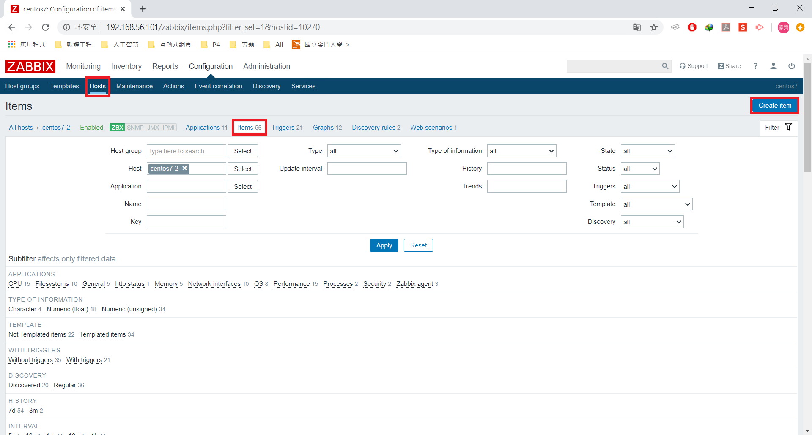

3. 在 Create Items 下設定 Name、Key、Update、Applications -> Add
* Name: cheak81port
* Key: net.tcp.listen[81]
* Update: 10s(建議更改)
* Applications: http status

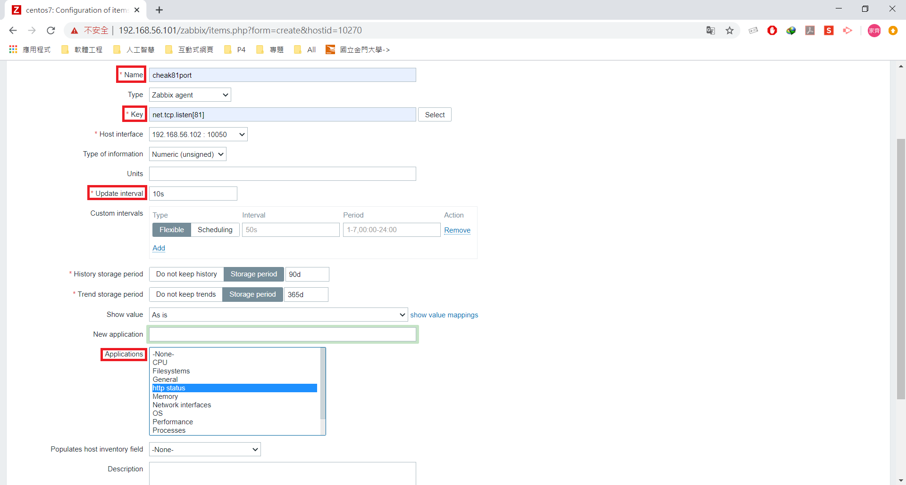

4. 確定新增成功

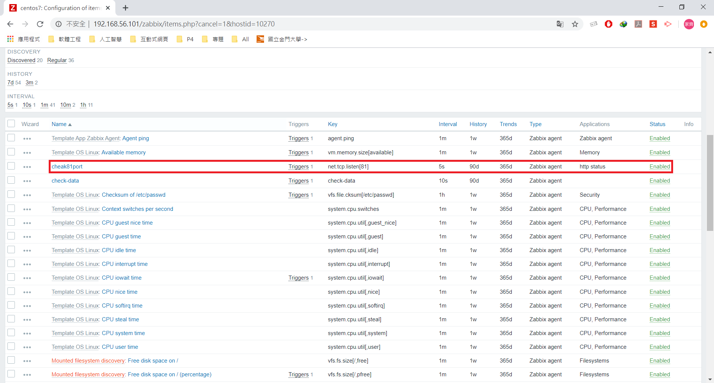


## 範例二
1. 到 Configuration 下的 Hosts ，點選 centos7-2 的 Triggers 


2. 選取新增 Create Triggers

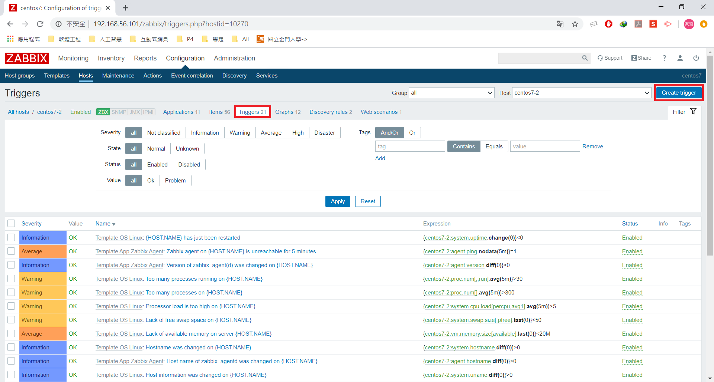

3. 在 Create Triggers 下設定 Name、Severity、Expression
* Name: cheak81
* Severity: Disaster

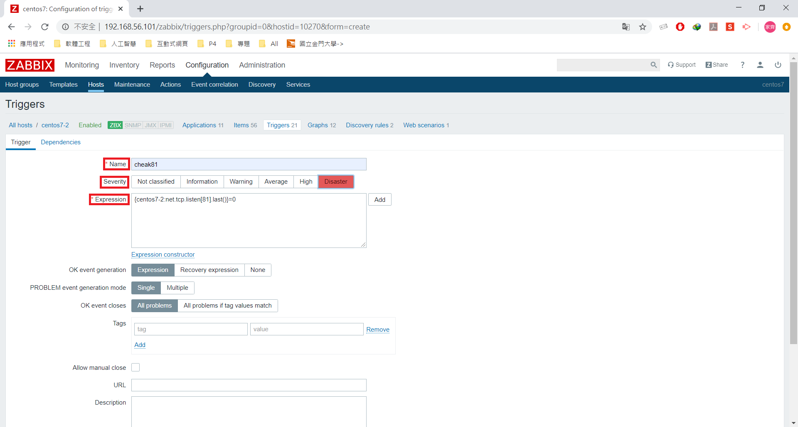

* Expression: {centos7-2:net.tcp.listen[81].last()}=0
  - Item:cheak81port
  - Function:last() - Last(most recent) T value


4. 確定新增成功

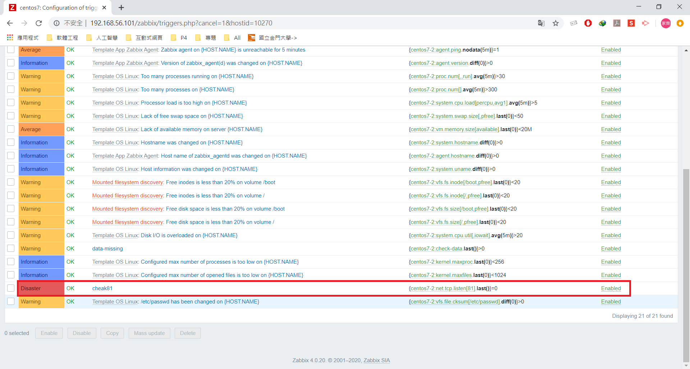

## 範例三 - 將訊息同步到 LINE Notify
1. 到 Administration 下的 Media types，點選新增 Create media type


2. 在 vm1 的 `/usr/lib/zabbix/alertscripts` 下編輯腳本檔 line.sh
> LINE Notify 的設定可看 [W11-20200513](https://github.com/linjiachi/Linux_note/blob/109-2/Weekly_Note/W11-20200513.md)
```sh
#!/usr/bin/bash
# LINE Notify Token - Media > "Send to".
TOKEN="金鑰"

# {ALERT.SUBJECT}
subject="$1"

# {ALERT.MESSAGE}
message="$2"

curl https://notify-api.line.me/api/notify -H "Authorization: Bearer ${TOKEN}" -d "message=${message}"
```

3. 在 Create media type 下設定 Name、Type、Script name -> Update
* Name: line
* Type: Script
* Script name: line.sh
* Script parameters: {ALERT.SUBJECT}、{ALERT.MESSAGE}

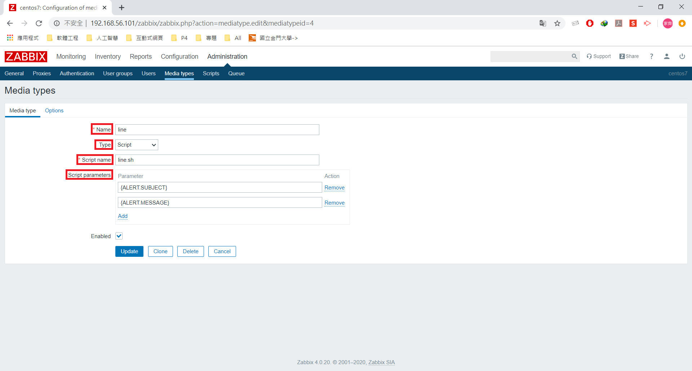

4. 點選右上角人頭設定 User profile: Zabbix Administrator，選擇 Media，再 Add 新增項目 


5. 在 Media 下，設定 Type、Send to -> Update
- Type: line
- Send to: zabbix

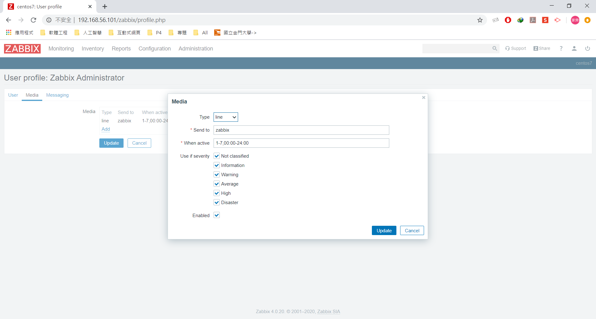


6. 在 Configuration 下的 Actions，設定 Action
- Name: port81_alert
- New condition: Trigger severity is greater than or equals Warning -> Add -> Update

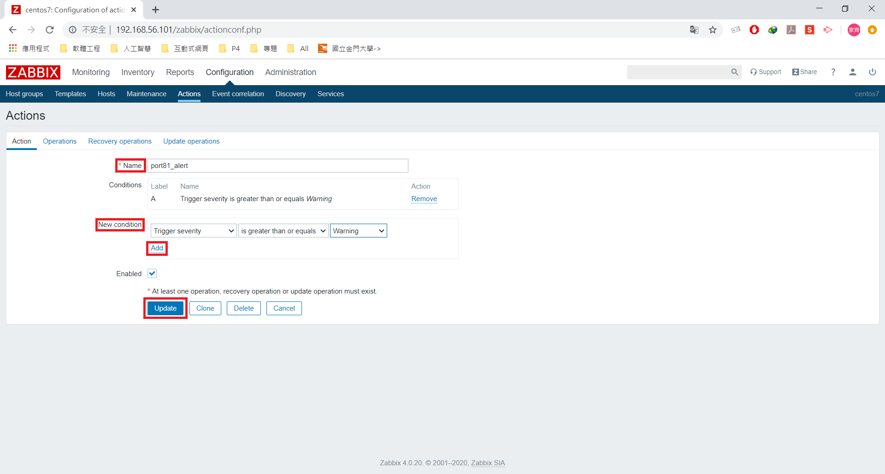

7. 在 Configuration 下的 Actions，設定 Operations 下的 Operations -> new
- Send to Users: Admin
- Send only to: line

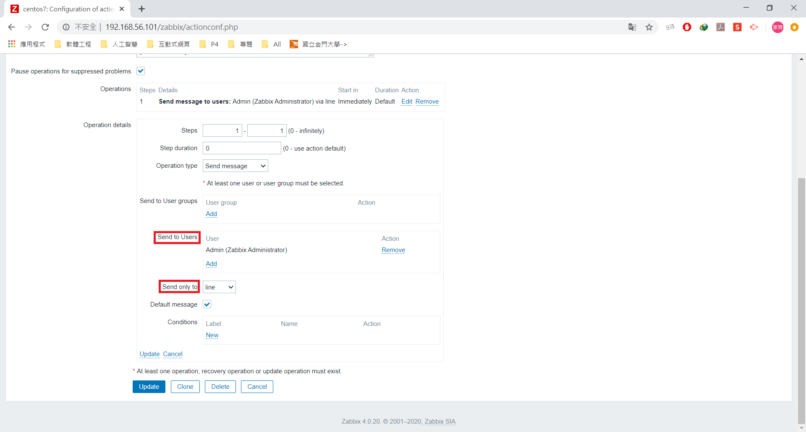

8. 在 Configuration 下的 Actions，設定 Recovery operations：與第7個步驟相同
9. 查看 Status 是否為 Enabled

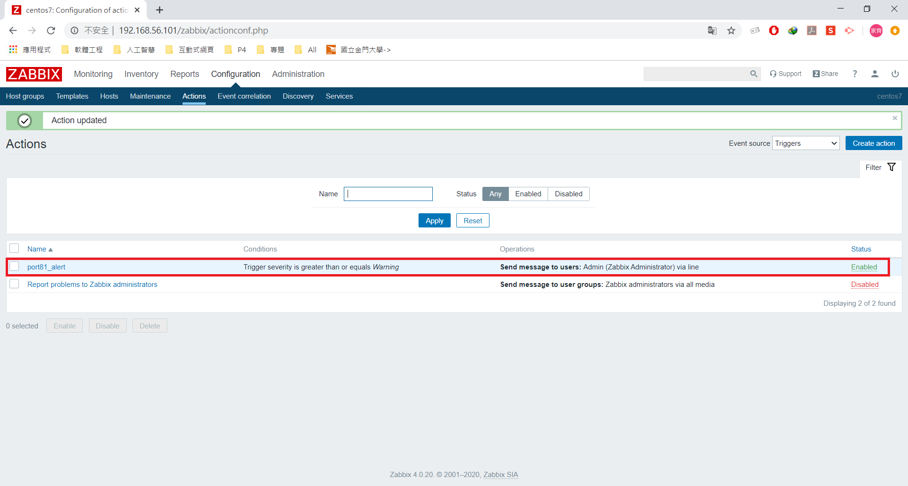

## 範例四 - 接收 web 訊息
1. 先到被控端 vm2 的 /var/www/html 資料夾下，新建一個 hi.htm
```sh
[root@vm2 html]# echo "hi" > hi.htm
[root@vm2 html]# cat hi.htm
hi
```
2. 點選 centos7-2 的 web 設定，點選 Create web scenario

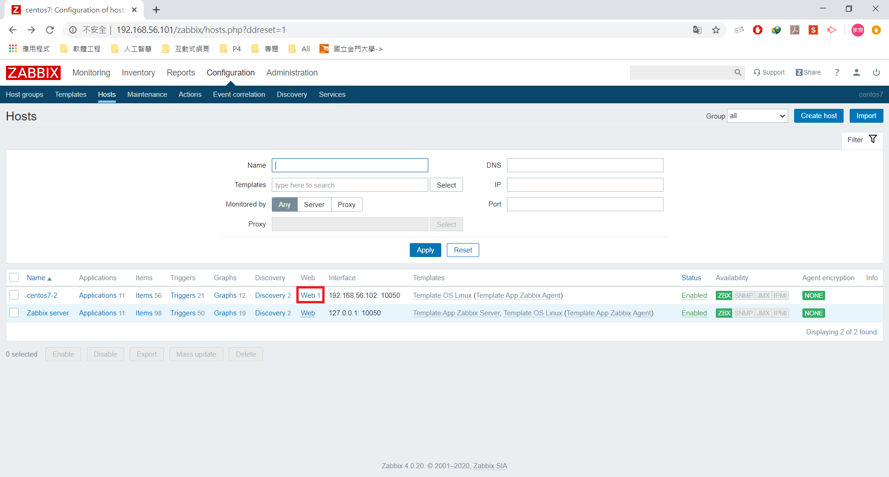


3. 在 Web monitoring 下的 Scenario 設定 Name
- Name: cheak_hi

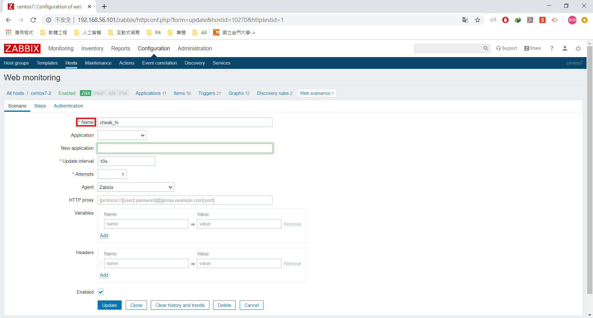

4. 在 Web monitoring 下的 Steps 設定 Name、URL、Required string、Required status codes
- Name: hi
- URL: http://192.168.56.102(被控端IP:port)/hi.htm
- Required string: hi -> 檢查網頁是否只有 hi，如果有其他文字，就代表有被竄改
- Required status codes: 200 -> 成功的回傳碼為 200 

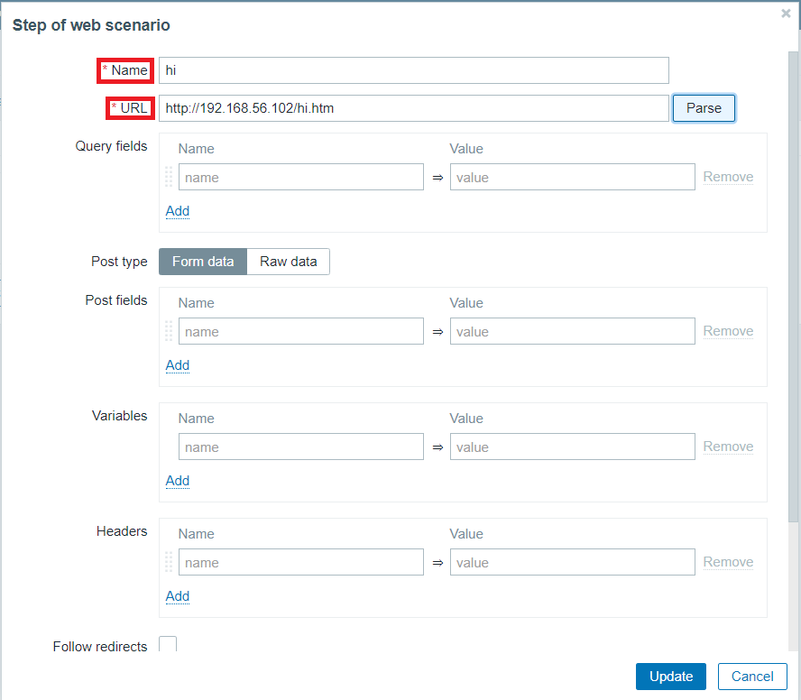


5. 查看是否新增成功


6. 測試更改網頁看是否報錯
```sh
[root@vm2 html]# echo "hello" > hi.htm
[root@vm2 html]# cat hi.htm
hello
```


> 出現紅字錯誤訊息

## 範例五 - 設定自定義監控
1. 到 /etc/zabbix/ 下編輯 zabbix_agentd.conf
```sh
### Option: UserParameter
#       User-defined parameter to monitor. There can be several user-defined parameters.
#       Format: UserParameter=<key>,<shell command>
#       See 'zabbix_agentd' directory for examples.
#
# Mandatory: no
# Default:
# UserParameter=
UserParameter=echo-test, echo 123
```
2. 重啟 zabbix-agent.service 服務：`systemctl restart zabbix-agent.service`
3. 可以到 vm1 測試是否收到訊息
```sh
[root@vm1 ~]# zabbix_get -s 192.168.56.102 -p 10050 -k "echo-test"
123
```

## 範例六 - 判斷 data 資料夾是否被刪除 
1. 新增一個 data 資料夾：`mkdir -p /data`
2. `ls /data &> /dev/null ; echo $?`：將指令的標準輸出與標準錯誤輸出丟到 /dev/null 裡，輸出 `echo $?` 的結果，0 為上一步驟成功，非 0 則為否
3. 到 /etc/zabbix/ 下編輯 zabbix_agentd.conf，並重啟 zabbix-agent.service 服務
```sh
### Option: UserParameter
#       User-defined parameter to monitor. There can be severameters.
#       Format: UserParameter=<key>,<shell command>
#       See 'zabbix_agentd' directory for examples.
#
# Mandatory: no
# Default:
# UserParameter=
UserParameter=echo-test, echo 123
UserParameter=check-data, ls /data &> /dev/null ; echo $?
```
4. 可以到 vm1 測試是否收到訊息
* data 資料夾存在
```sh
[root@vm1 ~]# zabbix_get -s 192.168.56.102 -p 10050 -k "check-data"
0
```
* 將 data 資料夾刪除
```sh
[root@vm1 /]# zabbix_get -s 192.168.56.102 -p 10050 -k "check-data"
2
```

## 範例七 - 將監控 data 資料夾加入到 zabbix
1. 新增 Create Items，設定 Name、Key
- Name: check-data
- Key: check-data

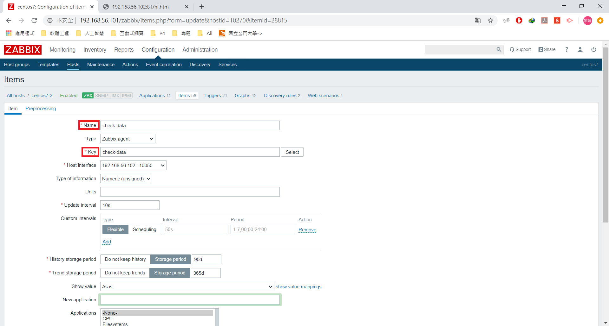

2. 新增 Create Triggers 下設定 Name、Severity、Expression
- Name: data-missing
- Severity: Warning
- Expression: {centos7-2:check-data.last()}>0

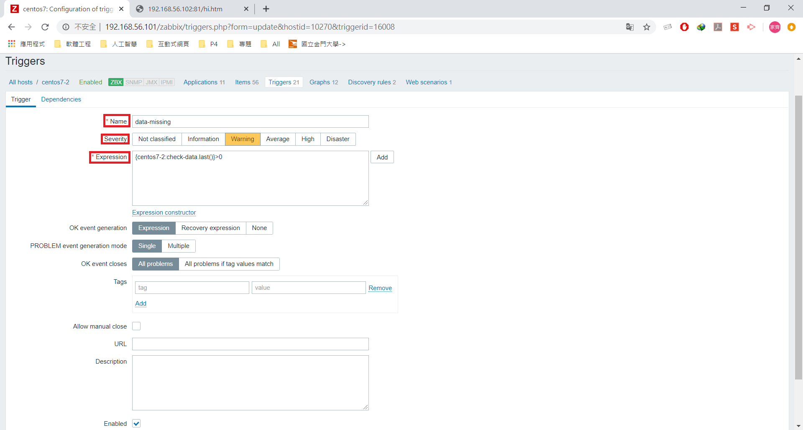


---
參考：
- [﹝Linux﹞Zabbix LINE Notify 警報通知](https://dotblogs.com.tw/xerion30476/2019/08/28/153643)
- [第4章 自定义监控与监控报警](https://www.cnblogs.com/clsn/p/7885990.html#auto-id-34)
